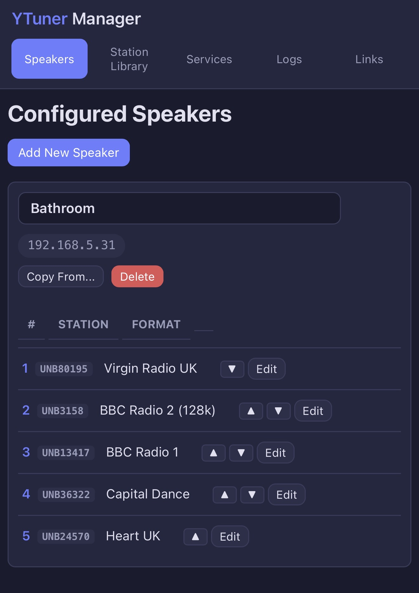
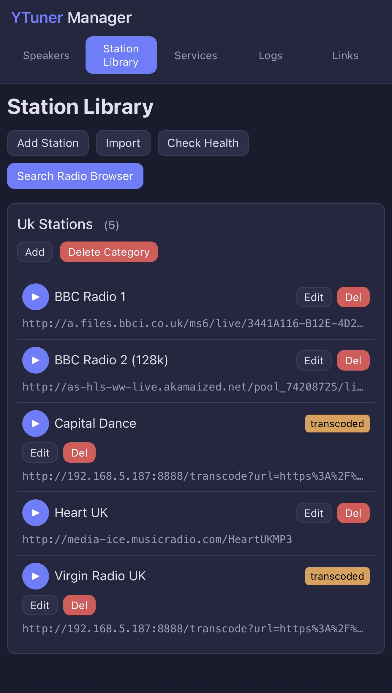
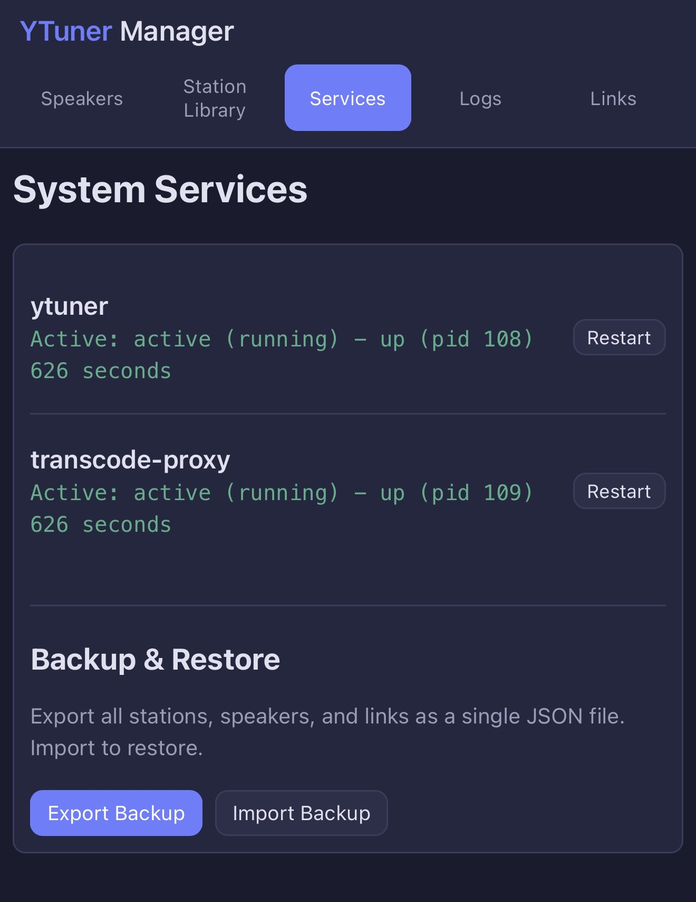

# YTuner Home Assistant Add-on Repository

A Home Assistant add-on that runs [YTuner](https://github.com/coffeegreg/YTuner) — a vTuner internet radio replacement for AVR devices (Yamaha, Denon, Pioneer, Marantz) and Libratone speakers.

## Installation

[](https://my.home-assistant.io/redirect/supervisor_add_addon_repository/?repository_url=https%3A%2F%2Fgithub.com%2FJarvichi%2Fha-addon-ytuner)

Or manually:

1. In Home Assistant, go to **Settings > Add-ons > Add-on Store**
2. Click the **three dots** menu (top right) and select **Repositories**
3. Add this repository URL:
   ```
   https://github.com/Jarvichi/ha-addon-ytuner
   ```
4. Find **YTuner** in the add-on store and click **Install**

## What's Included

The add-on runs four services in a single container:

| Service | Port | Description |
|---------|------|-------------|
| **Nginx** | 80 | Reverse proxy for AVR devices |
| **YTuner** | 18081 (internal) | vTuner-compatible radio server |
| **Web UI** | 8080 | Speaker and station management |
| **Transcode Proxy** | 8888 | Converts non-MP3 streams via FFmpeg |

## Screenshots

| Speakers | Station Library | Services |
|----------|-----------------|----------|
|  |  |  |

Manage speaker presets, browse and import stations, monitor services, view logs, and backup/restore your configuration — all from a mobile-friendly web UI.

## Configuration

See the [add-on documentation](ytuner/DOCS.md) for full details.

## Supported Architectures

- `aarch64` (Raspberry Pi 4/5, etc.)
- `amd64` (x86-64 PCs)
